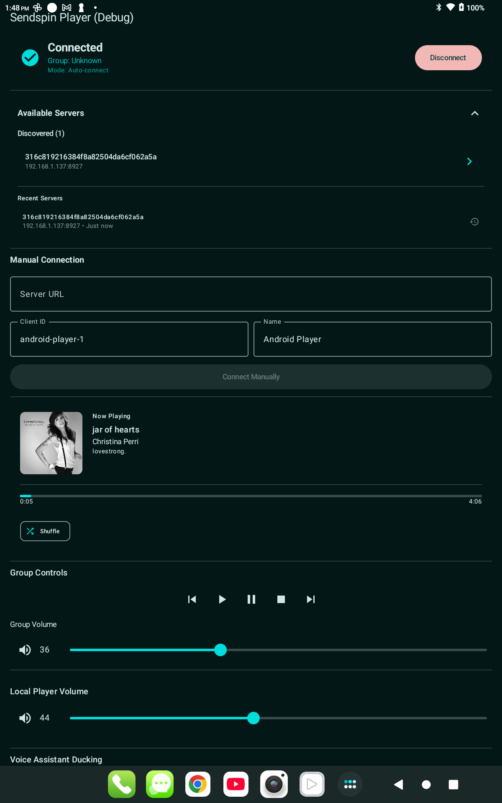

# SendspinAndroidSDK

Android SDK for synchronized multi-room audio streaming using the Sendspin protocol.

## Project Structure

This project contains **4 build variants** to support different use cases:


### 1. 📱 **demo-simple** (Simple Player App)
**Clean, minimal UI**

- Auto-connects to first discovered server
- Simple playback controls
- Playout offset adjustment
- Album artwork and track info
- Background playback with notifications

**Use this when:**
- You want a clean, minimal music player
- End users who just want to play music

**To build:**
```bash
./gradlew :demo-simple:assembleDebug
```

---



### 2. 🔧 **demo-debug** (Debug Player App)
**Full-featured debug UI with all controls**

- Everything from demo-simple, plus:
- Manual server connection
- Buffer statistics and sync details
- Clock convergence monitoring
- Voice assistant ducking controls
- Comprehensive debug information

**Use this when:**
- You're developing or debugging
- You need to fine-tune synchronization
- Testing network conditions
- Troubleshooting audio sync issues

**To build:**
```bash
./gradlew :demo-debug:assembleDebug
```

---

### 3. 🎧 **demo-headless** (Headless Player App)
**No UI - background audio player only**

- Starts playing automatically on boot
- Auto-connects to first discovered server
- Runs entirely in background as a service
- No activity, no UI, no user interaction

**Use this when:**
- Building dedicated audio endpoint devices
- Appliance-style audio receivers
- Devices that should "just work" without UI

**To build:**
```bash
./gradlew :demo-headless:assembleDebug
```

---

### 4. 📚 **sdk** (Library Module)
**Reusable SDK for integrating into your own apps**

- Core library module (no app, no UI)
- Clean public API via `SendspinClient`
- Auto-discovery support
- Background playback service
- Use this to build your own Sendspin-powered apps

**To integrate:**
```kotlin
// In your app's build.gradle.kts
dependencies {
    implementation(project(":sdk"))
}
```
